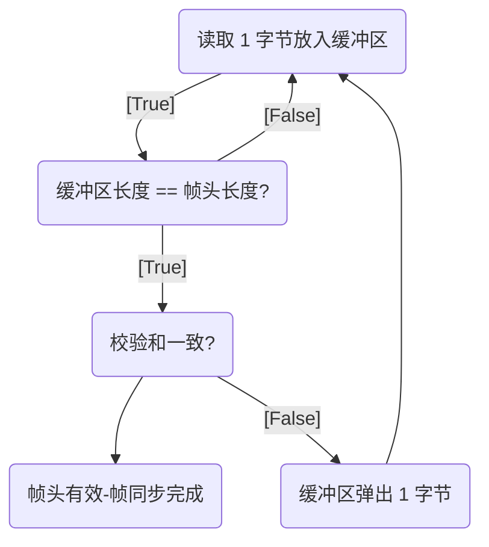
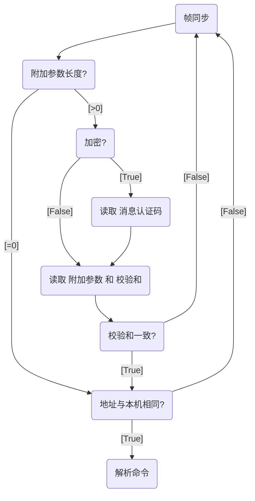

# HostService

用于嵌入式领域的上位机/下位机通信库

## 特点

1. 使用属性名作为变量标识符
2. 带权限控制
3. 支持加密通信
4. 单个属性值最少仅需占用 4Bytes 内存(用来存放虚表指针)
5. 通信协议简单(仿 Modbus 通信协议)
6. 全静态内存分配, 无需 `malloc`

## 通信协议

### 请求帧头

| 从机地址 | 命令           | 附加参数长度 | 校验和            |
| -------- | -------------- | ------------ | ----------------- |
| uint8_t  | uint8_t        | uint16_t     | uint16_t          |
| /        | MSB=1 代表加密 | /            | CRC16-CCITT-False |

### 响应帧头

| 从机地址 | 命令           | 错误码  | 附加参数长度 | 校验和            |
| -------- | -------------- | ------- | ------------ | ----------------- |
| uint8_t  | uint8_t        | uint8_t | uint16_t     | uint16_t          |
| /        | MSB=1 代表加密 | /       | /            | CRC16-CCITT-False |

### 附加参数

#### 未加密

| 内容                | 校验和            |
| ------------------- | ----------------- |
| 长度 = 附加参数长度 | CRC16-CCITT-False |

#### 已加密

| 消息认证码 | 加密内容            | 校验和            |
| ---------- | ------------------- | ----------------- |
| 16字节     | 长度 = 附加参数长度 | uint16_t          |
| CBC-MAC    | /                   | CRC16-CCITT-False |

注意: `消息认证码` 和 `加密内容` 共同参与 `校验和` 的计算
注意: 参与 `校验和` 计算的是 `加密后` 的内容

CBC-MAC 介绍: <https://en.wikipedia.org/wiki/CBC-MAC>
消息认证码 介绍: <https://en.wikipedia.org/wiki/Message_authentication_code>

加密采用 `AES-CCM` 算法, 能够确保数据的 `保密性` 和 `认证性`

## 校验和计算器

<https://crccalc.com/?crc=&method=CRC-16/CCITT-FALSE&datatype=hex&outtype=0>

## 帧同步算法

## 帧头解析算法

## 命令说明

### ECHO

名称: 回声

功能: 将接收到的附加参数原封不动地发回

附加参数: 任意长度数据

作用:

- 测试协议的实现是否正确
- 测试连通性
- 测试缓冲区大小
- 测试通信速率
- 测试加密密钥是否一致

### GET_PROPERTY

名称: 读取属性

功能: 根据属性 Id 读取属性

附加参数:

- 属性 Id
- 附加参数(可选)

返回值:

- 属性值
- 错误信息

作用:

- 读取指定的属性

### SET_PROPERTY

名称: 写入属性

功能: 根据属性 Id 写入指定的属性值

附加参数:

- 属性 Id
- 附加参数(可选)

返回值:

- 错误信息

作用:

- 写入指定的属性
- 执行特定的命令

### GET_SIZE

名称: 获取属性长度

功能: 根据属性 Id 获取指定的属性长度

附加参数:

- 属性 Id
- 附加参数(可选)

返回值:

- 属性长度
- 错误信息

作用:

- 获取指定属性的长度, 如数组长度

### LOG

名称: 日志

功能: Server 通过此命令传递运行中产生的日志信息

附加参数:

- 日志字符串

## 文件说明

- Common.hpp - 公共属性定义
- Extra.hpp - 附加参数模板
- FixedQueue.hpp - 环形缓冲区模板

---

- HostBase.hpp - Client/Server 的基类
- HostClient - Client 实现
- HostServer - Server 实现

---

- CPropertyHolder - Client 属性值容器
- CPropertyBase - Client 属性基类
- CMemory.hpp - Client 内存属性模板
- CProperty.hpp - Client 属性模板
- CRange.hpp - Client 带范围限制属性模板

---

- Mutex - Server 互斥量接口
- PropertyBase - Server 属性基类
- Memory - Server 内存属性模板
- Property - Server 属性模板
- Range - Server 带范围限制属性模板
