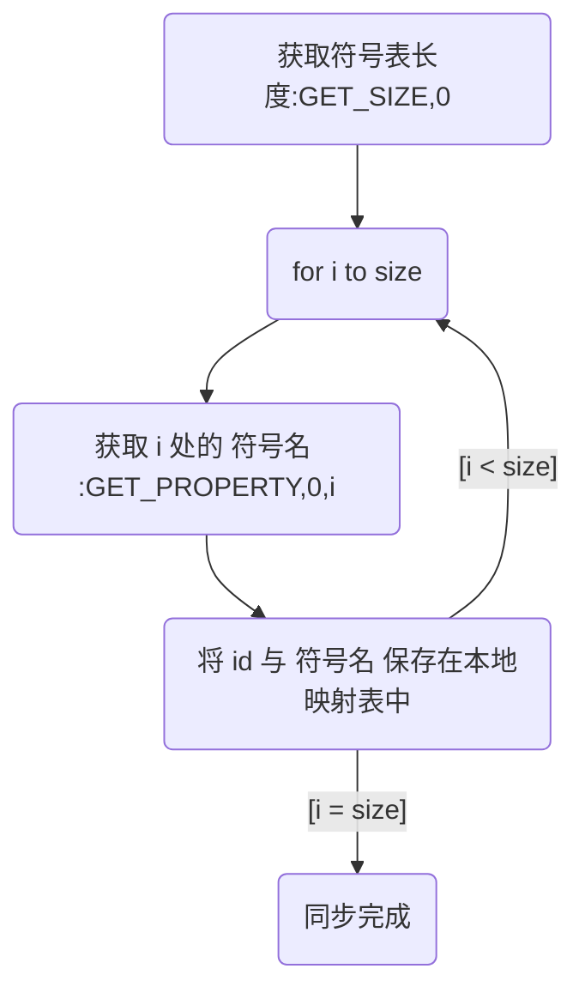

# HostService

用于嵌入式领域的上位机/下位机通信库

## 特点

1. 支持使用属性名作为变量标识符
2. 支持权限控制
3. 支持加密通信
4. 单个属性值最少占用 4 字节内存(用来存放虚表指针)
5. 通信协议简单(仿 Modbus 通信协议)
6. 全静态内存分配, 无需 `malloc`

## 协议

字节序: LSB 在前

### 帧头

| 从机地址 | 命令           | 附加参数长度 | 错误码  | 校验和            |
| -------- | -------------- | ------------ | ------- | ----------------- |
| uint8_t  | uint8_t        | uint16_t     | uint8_t | uint16_t          |
| /        | MSB=1 代表加密 | /            | /       | CRC16-CCITT-False |

### 附加参数

#### 未加密

| 内容                | 校验和            |
| ------------------- | ----------------- |
| 长度 = 附加参数长度 | uint16_t          |
| /                   | CRC16-CCITT-False |

#### 已加密

| 消息认证码 | 加密内容            | 校验和            |
| ---------- | ------------------- | ----------------- |
| 16字节     | 长度 = 附加参数长度 | uint16_t          |
| CBC-MAC    | /                   | CRC16-CCITT-False |

注意: `消息认证码` 和 `加密内容` 共同参与 `校验和` 的计算

注意: 参与 `校验和` 计算的是 `加密后` 的内容

CBC-MAC 介绍: <https://en.wikipedia.org/wiki/CBC-MAC>

消息认证码 介绍: <https://en.wikipedia.org/wiki/Message_authentication_code>

加密采用 `AES-CCM` 算法, 能够确保数据的 `保密性` 和 `认证性`

## 校验和计算器

<https://crccalc.com/?crc=&method=CRC-16/CCITT-FALSE&datatype=hex&outtype=0>

## 帧同步


## 帧解析


## 同步符号表



命令: GET_SIZE
附加参数: `0(uint16_t)`

- `0` 为 `symbols` 属性的 `属性Id`

应答:

- `size(uint16_t)` 符号表中元素的个数

---

命令: GET_PROPERTY
附加参数: `0(uint16_t)`, `i(uint16_t)`

- `0` 为 `symbols` 属性的 `属性Id`
- `i` 为需要获取 `符号名` 的 `属性Id`

应答:

- `zero-teminated string` `符号名`

## 命令

### ECHO

名称: 回声

功能: 将接收到的附加参数原封不动地发回

附加参数: 任意长度数据

作用:

- 测试协议的实现是否正确
- 测试连通性
- 测试缓冲区大小
- 测试通信速率
- 测试加密密钥是否一致

### GET_PROPERTY

命令: 读取属性

功能: 读取数值型属性/结构体属性

附加参数:

- 属性 Id `uint16_t`

返回值:

- 属性值 `uint8_t[sizeof(T)]`

---

命令: 读取内存

功能: 读取内存型属性

附加参数:

- 属性 Id `uint16_t`
- `MemoryAccess`

```c++
struct MemoryAccess
{
    uint16_t offset; // 地址偏移
    uint16_t size;   // 数据长度
};
```

返回值:

- 内存区数据 `uint8_t[size]`

---

命令: 读取范围属性

功能: 读取范围属性

附加参数:

- 属性 Id `uint16_t`
- `RangeAccess` `uint8_t`

```c++
enum class RangeAccess : uint8_t
{
    Range = 0, // 当前范围
    Absolute   // 范围的绝对最大值
};
```

返回值:

- 属性值 `uint8_t[sizeof(RangeVal<T>)]`

```c++
template <Number T>
struct RangeVal
{
    T    min;
    T    max;
};
```

### SET_PROPERTY

命令: 写入属性

功能: 写入指令型/数值型/结构体属性

附加参数:

- 属性 Id `uint16_t`
- 属性值 `uint8_t[sizeof(T)]`

返回值:

- 空

注意: 指令型属性写入后会执行相应的指令

---

命令: 写入内存

功能: 写入内存型属性

附加参数:

- 属性 Id `uint16_t`
- `MemoryAccess`
- 内存区数据 `uint8_t[size]`

返回值:

- 空

---

命令: 写入范围

功能: 写入范围属性

附加参数:

- 属性 Id `uint16_t`
- `RangeAccess`
- 属性值 `uint8_t[sizeof(RangeVal<T>)]`

返回值:

- 空

### GET_SIZE

命令: 获取属性字节长度

功能: 获取数值型/结构体属性的字节长度

附加参数:

- 属性 Id `uint16_t`

返回值:

- 属性字节长度 `uint16_t`

---

命令: 获取内存区字节长度

功能: 获取内存区属性的字节长度

附加参数:

- 属性 Id `uint16_t`

返回值:

- 内存区字节长度 `uint16_t`

---

命令: 获取范围字节长度

功能: 获取范围属性的字节长度

附加参数:

- 属性 Id `uint16_t`
- `RangeAccess`

返回值:

- RangeVal 的字节长度 `uint16_t`

### LOG

名称: 日志

功能: Server 通过此命令传递运行中产生的日志信息

附加参数:

- Trice 数据 `uint8_t[]`

Trice 介绍: <https://github.com/rokath/trice>

## 文件说明

- Common.hpp - 公共属性定义
- Extra.hpp - 附加参数模板
- FixedQueue.hpp - 环形缓冲区模板

---

- HostBase.hpp - Client/Server 的基类
- HostClient - Client 实现
- HostServer - Server 实现

---

- CPropertyHolder - Client 属性值容器
- CPropertyBase - Client 属性基类
- CMemory.hpp - Client 内存属性模板
- CProperty.hpp - Client 属性模板
- CRange.hpp - Client 带范围限制属性模板

---

- Mutex - Server 互斥量接口
- PropertyBase - Server 属性基类
- Memory - Server 内存属性模板
- Property - Server 属性模板
- Range - Server 带范围限制属性模板
